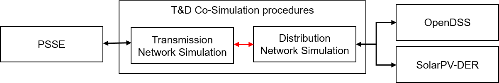

**Status:** Expect regular updates and bug fixes.

# Utilitiy to perform Co-Simulation of Transmission, and Distribution systems with DER's

Description of T&D co-simulation.




## Links
* Source code repository: https://github.com/tdcosim/TDcoSim
* [User guide](docs/chapter_1_introduction.md) 
* API Documentation:

## Installation
You can install the module directly from github with following commands:
```
    git clone https://github.com/tdcosim/TDcoSim.git
    cd
    pip install -e .
```

### Dependencies:
* External software: [PSS®E](https://new.siemens.com/global/en/products/energy/services/transmission-distribution-smart-grid/consulting-and-planning/pss-software/pss-e.html), [OpenDSS](https://sourceforge.net/projects/electricdss/)
* Python packages: [pvder](https://github.com/sibyjackgrove/SolarPV-DER-simulation-utility), SciPy, Numpy, Matlplotlib, PyWin

## Quick start

To start the simulation with the default config file, open a [command line prompt ](#visual-guide) within the folder containing the **runtdcosim.py** file (for e.g. by typing Shift+C+M+D). Then run the following script.

```
python runtdcosim.py > log_file.txt
```
### Use cases:
Following example use cases are provided:
1. [118 bus T + 123 bus D + DER](docs/Example_2.md)

## Module details
Further information on the module can be found here:
1. [Co-simulation data flow](docs/pvder_integration_info_flow.pdf)
2. [Software components](docs/software_details.md)

## Issues
Please feel free to raise an issue when bugs are encountered or if you are need further documentation.

## Who is responsible?
**Project PI:**

- Ning Kang kang@anl.gov

**Core developers:**

- Karthikeyan Balasubramaniam kbalasubramaniam@anl.gov
- Sang-il Yim yim@anl.gov

**Support:**

- Siby Jose Plathottam splathottam@anl.gov
- Rojan Bhattarai rbhattarai@anl.gov

## Acknowledgement
The authors would like to acknowledge [Shrirang Abhyankar](https://github.com/abhyshr) for his contribution.

## Citation
If you use this code please cite it as:
```

```
### Copyright and License
Copyright © 2019, UChicago Argonne, LLC

Transmission and Distribution System Co-simulation Tool (TDcoSim) is distributed under the terms of [BSD-3 OSS License.](LICENSE.md)
