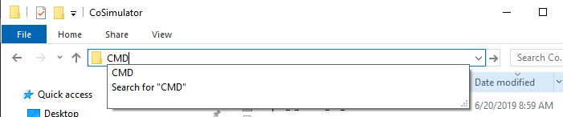
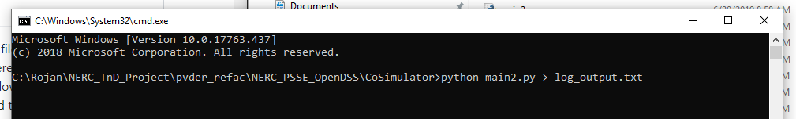

# Chapter 3

## How to use TDcoSim?
The TDcoSim module can be imported and used like a normal Python module.

 ```python
   import TDcoSim
 ```

### Quick start a simulation using the default config file

To start the simulation with the default config file, open a [command line prompt ](#visual-guide) within the folder containing the **runtdcosim.py** file (for e.g. by typing Shift+C+M+D). Then run the following script.

```
python runtdcosim.py > log_file.txt
```

**rundtdcosim.py ** is a script that starts the co-simulation and logs generated during the co-simulation are written to **log_file.txt** (or any other user specified .txt file).

### Using TDcoSim within your script
The basic steps to write your own co-simulation program are as follows:

1. Setup desired T+D or T+D+DER system by making necessary entries in the [**config**](docs/chapter_2_understanding_config_file.md) file.

2. Import necessary classes.

   ```python
      from report import generateReport
      from global_data import GlobalData
      from procedure.procedure import Procedure
   ```

3. Read the **config** file and initialize the T&D system.

   ```python
       GlobalData.set_config('config.json')
       GlobalData.set_TDdata()
   ```

4. Create a procedure object for the simulation and call *simuate()* method.

   ```python
       procedure = Procedure()
       procedure.simulate()
   ```

5. Generate report after *simuate()* exits.

   ```python
       generateReport(tdcosim.GlobalData,fname='report.xlsx')
   ```


### Visual guide


<h5><center>Figure 1: Opening command line</center></h5>


<h5><center>Figure 2: Starting TDcoSim tool from commandline</center>