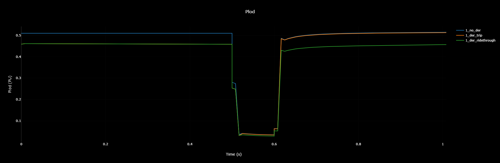
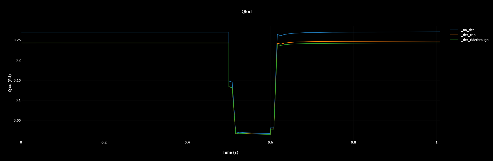
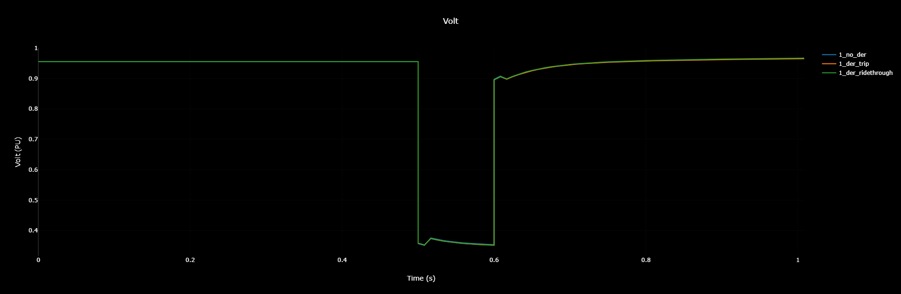
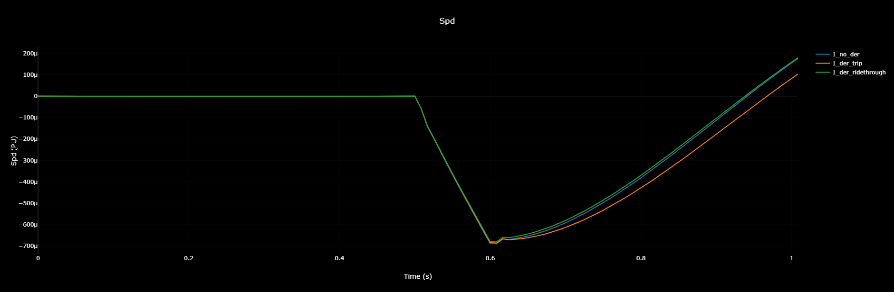

# Example 1: DER Tripping and DER riding through fault (detailed DER)

In this example, TDcosim is used to test the following scenarios on the same T+D+DER system.
* DERs instantaneously tripping during a voltage anomaly caused by a T bus fault.
  * [Config file](https://github.com/tdcosim/TDcoSim/tree/master/tdcosim/examples/example_1a_config_case118_dynamics_tripping_detailed_der.json)
* DERs riding through a voltage anomaly caused by a T bus fault
  * [Config file](https://github.com/tdcosim/TDcoSim/tree/master/tdcosim/examples/example_1b_config_case118_dynamics_ridethrough_detailed_der.json)

1. **T system:** 118 bus system

```json
"psseConfig": {    
		       "rawFilePath": "data\\transmission\\118bus\\case118.raw",
			   "dyrFilePath": "data\\transmission\\118bus\\case118.dyr"
               }
```

2. **D + DER system:** 123 node feeder connected to bus 1 of 118 bus system.
   * DER penetration: 10% of distribution system load
   * DER model type: Detailed DER model
      * DER model sub-type:Three Phase Unbalanced

```json
"manualFeederConfig":{
                        "nodes": [
                            {
                                "nodenumber": 1,
                                "filePath": ["\\SampleData\\DNetworks\\123Bus\\case123ZIP.dss"],
                                "solarFlag":1,
                                "DERModelType": "ThreePhaseUnbalanced",
                                "solarPenetration": 0.1,
                                "initializeWithActual": true,
                                "DERFilePath": "config\\detailed_der_default.json", 
                                "DERParameters":{
                                "default":{
                                     "pvderScale": 1, 
                                     "steadyStateInitialization": true, 
                                     "derId": "50_instant_trip"                 
                                          }
                                               }
                            }
                        ]
                    }
```
3. **Simulation configuration:** A 3 phase fault is applied in bus 5 of the T-system. The simulation configuration to apply fault on bus 5 is shown below:

```json
"simulationConfig":{
	    "protocol": "loose_coupling", 
        "simType":"dynamic",
        "dynamicConfig":{
            "events":{
                "1":{
                    "time":0.5,
                    "type":"faultOn",
                    "faultBus":5,
                    "faultImpedance":[0.0,-100000]
                    },
                "2":{
                    "time":0.6,
                    "type":"faultOff",                    
                    "faultBus":5
                    },
                "3":{
                    "time":1.0,
                    "type":"simEnd"                    
	                }
                     }}
```

#### Scenario A: Instantaneous trip
The DER trip setting used for this case is shown in Figure A below. The full configuration file is 


Figure A: DER operational settings curve for the instantaneous trip settings.
4a. **DER Interconnection standard:** TRIP instantaneously on voltage anomaly (i.e. voltage below level "0" threshold).

```json
   {
    "50_instant_trip":{"parent_config":"50",
   				   "LVRT":{"config_id":"LVRT_instant_trip"}
   	 			   },
   "LVRT_instant_trip":{"config":{"1":{"V_threshold":0.88,
                                       "t_threshold":0.001,
                                       "t_min_ridethrough":0.001,
                                       "mode":"momentary_cessation"
                                      }
                                 }
                        }
   }
```
#### Scenario B: Ride through

The DER trip setting used for this case is shown in Figure B below.

 
Figure B: DER operational settings curve for the DER ride through settings.

4b. **DER Interconnection standard:** Ride through during the voltage anomaly (i.e. voltage below level "0" threshold).

```json
{
   "50_ridethrough":{"parent_config":"50",
                      "LVRT":{"config_id":"LVRT_ridethrough"}
                     },
   "LVRT_ridethrough":{"config":{"1":{"V_threshold":0.88,
                                       "t_threshold":10.0,
                                       "t_min_ridethrough":20.0,
                                       "mode":"mandatory_operation"
                                      }
                                }
                      }
}
```

## Results
Figure 1 compares the active power component of the load observed in the T-bus for the three cases considered. It can be observed that case C, without DER on the distribution starts off with higher initial net load. Case A and Case B has a lower initial net load due to the DER connected in the distribution system masking the portion of total load in the system. Here net load is defined as the difference of the total load in the distribution system and the DER connected in the distribution system. 


Figure 1: Active component of load as observed at the T-bus for the cases considered. (A): 10% DER penetration with DER TRIP Settings, (B): 10% DER penetration with DER RT Settings and (C) 0% DER penetration.

For the DER trip case, Case A, it can be observed that the net load observed in the bus increases to a value equal to the case without any DERs in the system, case C, which is an expected response of the system as net load in the T-bus reverts back to the total load as DER in the distribution system trips. A similar response can be observed for the reactive power component of the net load in the system as shown in Figure 2, which shows that the net reactive power equals the total reactive power as when DER trips, the system reverts back to the operational condition before DER connection in the system.


Figure 2: Reactive component of load as observed at the T-bus for the cases considered. (A): 10% DER penetration with DER TRIP Settings, (B): 10% DER penetration with DER RT Settings and (C) 0% DER penetration.


Figure 3:  T-bus 1 voltage comparison for the cases considered. (A): 10% DER penetration with DER TRIP Settings, (B): 10% DER penetration with DER RT Settings and (C) 0% DER penetration.


Figure 4:  Generator 1 Speed Comparison for the different cases considered.

Figure 3 shows the transmission bus voltage for bus 1 for the three cases considered. It can be observed that the voltage at bus 1 is same for all the cases considered. This is because for this case bus 1, where distribution system is connected, also had a synchronous generator connected to it which was regulating the bus voltage. Figure 4 shows the generator rotor frequency for the cases considered. It can be observed that the frequency nadir following system fault close to the fault location is lower for the case with DER trip. More tests with more distribution system and DERs should be performed to properly study the impact of DERs on system frequency response.

\pagebreak