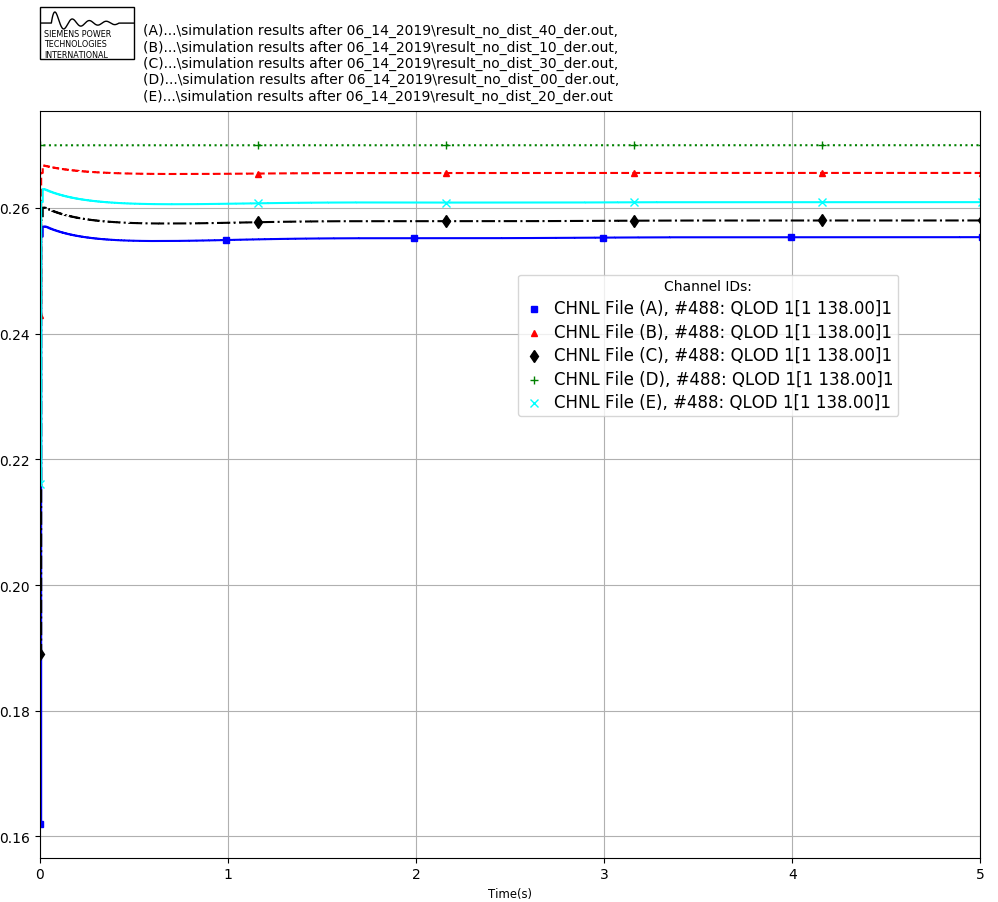
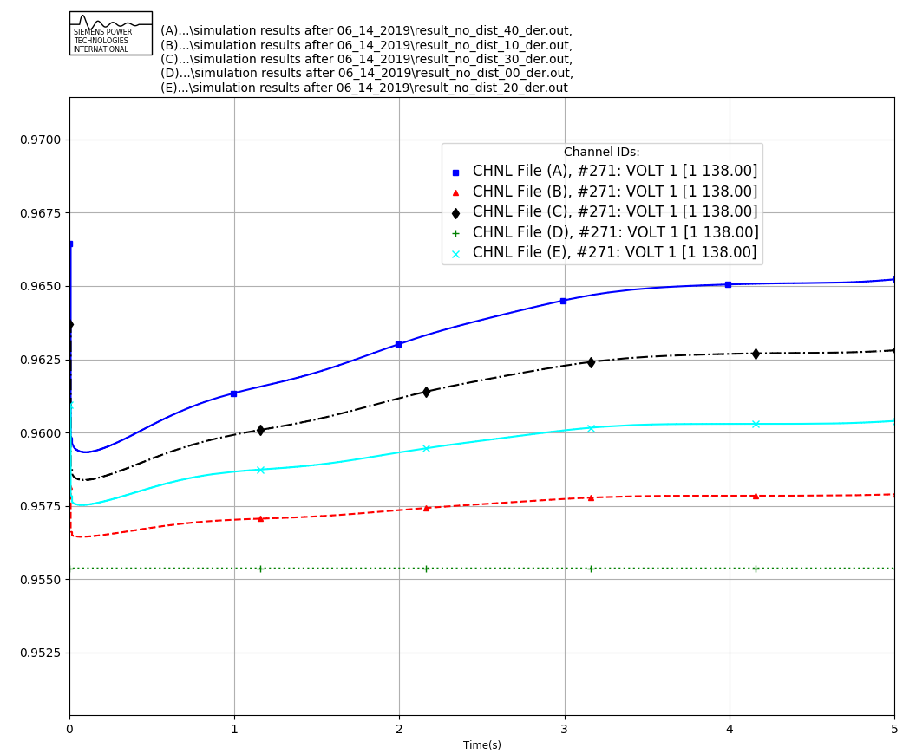

# Example 2: Test of system state initialization with TDcoSim tool

In this test study, different penetration level of DERs within one distribution system connected to a transmission bus is studied. The purpose of this study is to test the ability of the tool to properly initialize the states of all the dynamic components of the system. Without any disturbance introduced in the system through changes in operating points or faults, it is expected that the responses of the various components in the system be a flat profile if the state of the various components are properly initialized i.e. all the variables should have a constant value throughout the duration of simulation.

The DER configuration used in this case is as follows, where the "solarPenetration" was varied with 10% increment for each of the cases: 

    "manualFeederConfig":{
            "nodes": [
                {
                    "nodenumber": 1,
                    "filePath": ["\\SampleData\\DNetworks\\123Bus\\case123ZIP.dss"],
                    "solarFlag":1,                
                    "DERParameters":{
                    "default":{
                        "solarPenetration":0.0, 
                        "powerRating": 50,
                        "VrmsRating":174                    
                    }}
                }
            ]
        }

The study was done with 123 node distribution system connected to bus 1 of the IEEE 118 bus system and five different DER penetration level relative to load in bus 1 ranging from 0 to 40% with the step increment of 10% is studied.

Figure 6: Active Power observed in bus 1 for the different cases considered (Green: No DER, Red: 10% DER, Cyan: 20% DER, Black: 30% DER, Blue: 40% DER).

Figure 7: Reactive power observed in bus 1 for the different cases considered. (Green: No DER, Red: 10% DER, Cyan: 20% DER, Black: 30% DER, Blue: 40% DER)

Figure 8: Reactive power observed in bus 100 for the different cases considered. (Green: No DER, Red: 10% DER, Cyan: 20% DER, Black: 30% DER, Blue: 40% DER)

Figure 6 shows the flat start performance of the TDcosim tool for different penetration level of DER. It can be observed that with the DER added into the test system, TDcosim tool takes couple of secs to reach the steady state active power consumption at the DER connected bus. Also, note that the settling value of the net active power is slightly below to the calculated net load power based on DER penetration. One of the reason for this is that the addition of DER within the distribution feeder doesn't amount to an exact amount of net load drop within the distribution feeder. This depends on the various factors like power output of the DER, location of DER, nature of the loads modelled and so on. We are working to have the net load initialized properly.

Figure 7 shows the reactive power observed in bus 1 for the different cases considered. It can be observed that the reactive power consumed at the DS & DER connected bus decreases as DER penetration increases. Figure 8 shows no change in the reactive power for a random bus (bus 100).

Figure 9: Voltage profile observed in bus 1 for the different cases considered. (Green: No DER, Red: 10% DER, Cyan: 20% DER, Black: 30% DER, Blue: 40% DER)

Figure 10: Voltage profile observed in bus 2 for the different cases considered. (Green: No DER, Red: 10% DER, Cyan: 20% DER, Black: 30% DER, Blue: 40% DER)

Figure 11: Voltage profile observed in bus 100 for the different cases considered. (Green: No DER, Red: 10% DER, Cyan: 20% DER, Black: 30% DER, Blue: 40% DER)

Figure 9 shows the voltage plot for bus 1 for the different cases considered. It can be observed that the with the DER added in the system, the bus voltage settles at a higher steady state voltage and it takes almost 4 secs for the system to reach a steady state. Similar settling time were observed in the buses nearby the DER connected buses as shown in Figure 10.

Such differences in settling time were not observed in electrically distant buses as shown in Figure 11, even though steady state differences were observed between different cases.

Figure 12 shows the generator speed profile for the base case scenario without any DER penetration. It can be observed that the system frequency is initialized at exactly 60 Hz and stays constant at 60 Hz throughout the simulation. Figure 13 shows the generator speed profile for the 40 percent DER penetration case. It can be observed that the generator speed has few oscillations that dies down slowly over time. The oscillations are due to the mismatch in the calculation of initial conditions for load and generation.

Figure 11: Frequency plot for the system generators for the base case with zero DER penetration.

Figure 11: Frequency plot for the system generators for the case with 40 percent DER penetration.

Please note that the tool takes few simulation seconds for the system to reach a steady state solution for the dynamic cases. The developers are working on the initialization of system dynamic states so as to obtain a steady state solution from time t=0+. So for the current version of the tool, to study the system dynamics change of operating points and disturbances are applied only after the system reaches a certain steady state threshold i.e. at least 0.5 seconds.

\pagebreak