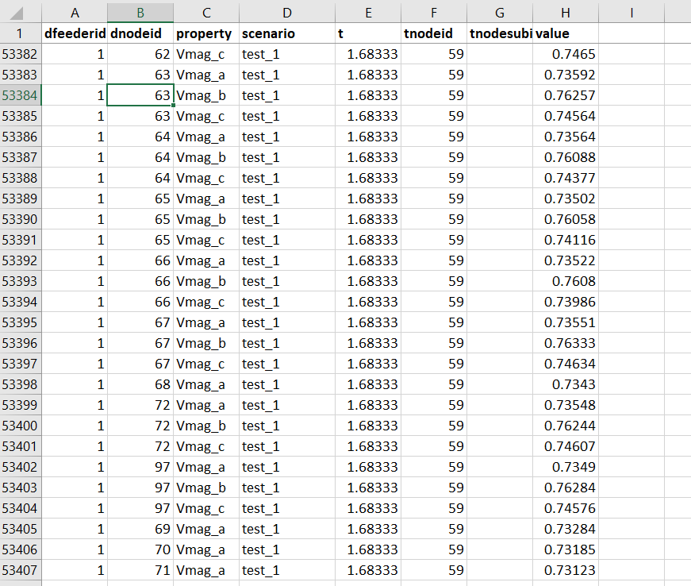

# Getting started with TDcoSim

In this section, we describe how you can get started with using **TDcoSim** to conduct static or dynamic co-simulation studies for T & D systems with different DER penetration levels and various events.

## 1. Setup TDcoSim
Please install the software per installation instructions as the first step (Installation instructions for can be found [here](user_guide_installation.md#installation)). Make sure the system requirements are satisfied (System requirements can be found [here](user_guide_sys_requirements.md)). 

### Invoking TDcoSim from command prompt
Once TDcoSim has been successfully installed, we get access to the *tdcosimapp* from the command line. The *tdcosimapp* is to *TDcoSim* what *kubectl* is to *kubernetes*. The following functionalities are available through the *tdcosimapp*:

1. Describe the location of folders containing logs, example configurations, T system models, D system models etc.: **tdcosim describe**
2. Run test configurations: **tdcosim test**
3. Create configuration template: **tdcosim template --templatePath "/path/to/save/template.json"**
4. Validate user provided configuration, providing helpful hints to troubleshoot issues, if there are any.
6. Run the co-simulation: **tdcosim run -c "/path/to/config.json"**
7. Launch browser based dashboard to analyze the results: **tdcosim dashboard -o "/path/to/df-pickle.pkl"**
7. Provide information/help about any top level declaration used in configuration file: **tdcosim info --configHelp** *configtype* (**psseConfig, openDSSConfig, simulationConfig, outputConfig, logging**) 


***
***Note:*** The **tdcosimapp** can be invoked using the **tdcosim** command from the command line .

***

## 2. Information required by TDcoSim
1. Specify version of PSS/E (either PSS/E 33 or PSS/E 35)
1. Specify parameters for the power system to be analyzed:
   
   * Transmission system
        * Transmission system model (e.g. IEEE 118 bus system)
          * Supported file formats:*.raw, *.dyr 
        * Buses where distribution system models are attached
        * Type of load model (static,ZIP,CLOD,CMLD).
        * Presence of DER_A model
   * Distribution system
        * Distribution system model (e.g. IEEE 123 node feeder)
          * Supported file formats:*.dss  
        * Solar PV penetration level (fraction of the distribution system load)
        * Scaling factor for power output from single DER model instance 
   * DER parameters  (optional)
        * Type of DER model (fast DER or detailed DER)
        * DER voltage and power ratings (e.g. 50 kW, 175 V)
        * DER interconnection standard during voltage anomaly (eg. IEEE 1547 Category II)
        * Settings specific to detailed DER:
          * DER configuration file path
          * DER configuration ID (e.g. '50') -> only for detailed
          * Type of ODE solver
   
2. Specify whether simulation is static or dynamic.

3. Specify length of simulation (e.g. 5 s).

4. Specify transmission bus fault events (optional).

   * Start and end time of fault (for e.g. 0.5 s, 0.667 s)
   * Bus at which fault occurs and fault impedance value.

6. Specify directory for logging, and results.

***
***Note:*** Frequency ride through will be included in future version.

***
***
***Note:*** Other disturbance events like loss of generator, line trip etc. will be included in future version.

***

## 2. Configure T & D & DER models and simulation scenarios
The power system models and simulation scenarios defined in the previous section can be transferred to TDcoSim using the **TDcoSim config** file (detailed explanations for every entry in the **TDcoSim config** file is provided [here](user_guide_understanding_config.md#understanding-the-config-file)). 

### Defining the TDcoSim config file

The **TDcoSim config** file follows a specific template, and any deviations from the template will result in an error. The most streamlined way to make sure that the template is followed, is generate a sample config file and then manually populate the fields in this file. An example command for generating a sample config file for a dynamic co-simulation is given below:
```
tdcosim template --templatePath config_dynamic_example.json --simType dynamic
```
A detailed description of the configuration template is provided in the [Using the configuration template](user_guide_user_interaction.md) chapter.
***
***Note:*** The **config** file can be edited with Notepad++.

***

***
***Note:*** The **config** file can be in any folder on the user machine.

***

## 2. Running the co-simulation

Once the **config** file has been populated with the required entries, the user can start the co-simulation through the run command on command line as shown below:

```
tdcosim run -c "\path\to\config\config_dynamic_example.json"
```
The user will see a progress bar similar to the one shown below:

```
             INITIATED ON WED, JUN 02 2021  14:54
Simulation Progress : ====================> 100.04000000000013%(0.5002000000000006s/0.5s)
Solution time: 9.066482067108154
```

***
***Note:*** Logs generated during co-simulation are can be found in the **install\path\tdcosim\logs** folder.

***

## 3.  Accessing the results

Outputs (from both transmission and distribution systems) are saved in the following formats within the user specified output folder at the end of the co-simulation: 
1. PSS/E channel output file (**.out**) for containing all the simulated quantities from PSS/E.
2. A pickle (**df_pickle.pkl**) file containing the values of co-simulation variables from both PSS/E and OpenDSS. The co-simulated variables are stored as a data frame (as shown in Fig. 1). More information on the fields within the data frame is provided in [TDcoSim Data Visualization and Analytics](user_guide_visualization_analytics.md#TDcoSim-DataFrame ).
3. An **options.jSON** file containing the configuration parameters for the co-simulation. 
4. A **psse_progress_output.txt** file containing logging information from PSS/E.


<p align="center">
  <strong>Fig. 1. </strong>Dataframe generated after Dynamic T&D co-simuation.
</p>

***
***Note:*** The **.pkl**, **.JSON**, and **.out** files will be found in the folder specified by the user through the **output** field in the config file.

***

## 4. Data visualization and analytics
Modules for performing visualization and analytics are available as part of the TDcoSim package. The simplest way to visualize the data is using the **TDcoSim Dashboard** which may be launched using the command shown below.

```
tdcosim dashboard -o "path/to/results.pkl"
```

Detailed intructions on the **TDcoSim Dashboard** and other analytic tools are included in the [TDcoSim Data Visualization and Analytics](user_guide_visualization_analytics.md) chapter.

## Examples

Example **TDcoSim config** files for static and dynamic co-simulation scenarios are available in **install\path\tdcosim\examples** folder.

\pagebreak