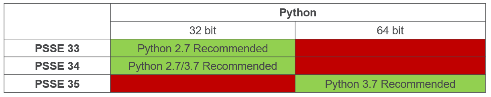

# Installation
The stable release of TDcoSim can be installed from PyPI. The version under development can be installed from [GitHub](https://github.com/tdcosim/TDcoSim). The commands to be executed in the Windows command-line interface for both options are included below:

You can install tdcosim by running the following command on the command line.

```
pip install git+https://github.com/tdcosim/TDcoSim.git@master
```

In the event you do not have git installed on your machine, you can alternatively run the following from the command line.

```
pip install https://github.com/tdcosim/TDcoSim/archive/master.zip
```

After installation open a new command prompt and run the following to set PSSE path,

```
tdcosim setconfig -p "path\to\psse_installation"  
```

For example, something similar to:

```
tdcosim setconfig -p "C:\Program Files\PTI\PSSE35\35.0\PSSPY37" 
```

Due to the embedded compatibility requirements between PSSE and Python, 
please refer to the following compatibility table and the PSSE API document located in the Doc folder on PSSE install location when paring PSSE with Python.

It should be noted that the table below is a subset of all successful combinations from our team’s development environment, 
and it is crucial to set the PSSE installation path properly so that the module PSSPY can be located. 



***
***Note:*** [Git](https://git-scm.com/) needs to be installed  (in case it is not already available) before TDcoSim can be installed.

***

## Post Installation

Get info about tdcosim

    tdcosim describe

Test if tdcosim example simulations (dynamics and QSTS) are working,

    tdcosim test


## Dependencies:
The packages listed below must be installed separately:

### Required

* [Python](https://www.python.org/) version = 2.7.5 for PSS®E, version =  33.3.0, version >= 3.5 for PSS®E, version =  35.0.0
* Power system simulator: [PSS®E, version =  33.3.0 or PSS®E, version =  35.0.0](https://new.siemens.com/global/en/products/energy/services/transmission-distribution-smart-grid/consulting-and-planning/pss-software/pss-e.html)
* Distribution system simulator: [OpenDSS, version >= 8.6.1.1](https://sourceforge.net/projects/electricdss/) 
* DER simulator: [Solar PV-DER simulation utility, version >= 0.5.1](https://github.com/sibyjackgrove/SolarPV-DER-simulation-utility)
* Python packages for basic functionalities: SciPy, Numpy, Matlplotlib, Pywin32, XlsxWriter, Psutil
* Python packages for visualization: Dash, Plotly

***
***Note:*** Either demo (limited to 50 buses) or full version of PSS/E can be used.  OpenDSS is open-source software and can be installed for free.

***
***
***Note:*** PSS/E 35.0.0  and above support will support both 32 and 64-bit versions of Python.
***

### Optional

* For using the high performance ODE solver [diffeqpy, version >= 1.1.0](https://github.com/SciML/diffeqpy)

  * Install tdcosim with the diffeqpy flag as shown below.
    ```
       pip install tdcosim[diffeqpy]
    ```
  * Download and install Julia interpreter: [Julia, version >= 1.5](https://julialang.org/downloads/)

  * Add Julia to system PATH environment variables as shown [here](https://julialang.org/downloads/platform/) (Only for Windows OS).

***
***Note:*** If co-simulations involving more than 10 detailed DER models are needed to be run, it is recommended to select *diffeqpy* as the ODE solver.

***
***
***Note:*** All Python packages can be installed with *pip* (e.g. *pip install scipy*)

***

