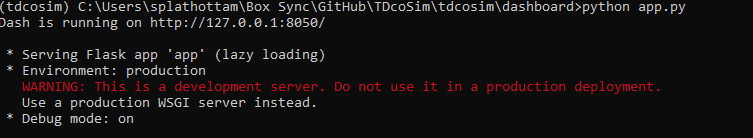
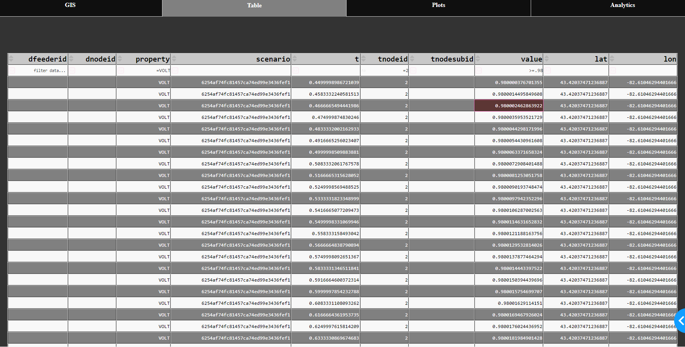
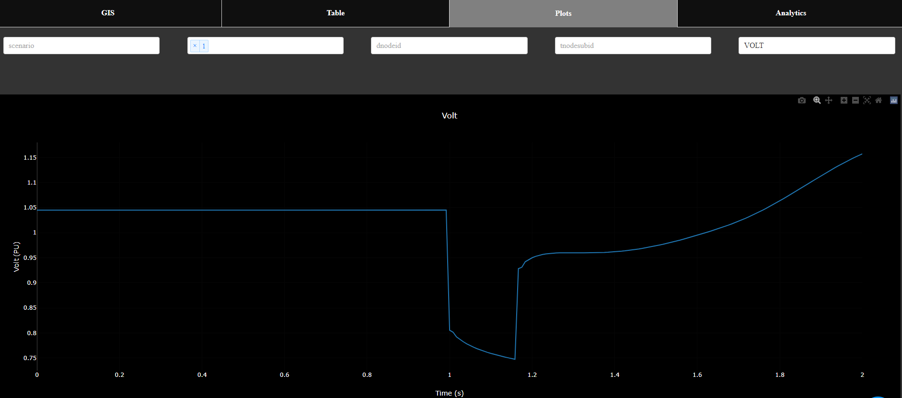

# Using Data Visualization and Analytics

During the co-simulation, TDcoSim collects and stores a lot of data from the transmission system, distribution system, and DER models. The amount of data may make it challenging to the user to make effective use of it. We have implemented the following three features to  improve the user experience with using the co-simulation data:
1. Store data using a TDcoSim DataFrame.
2. Provide a visualization dashboard
3. Provide data analytics module.

## TDcoSim DataFrame
TDcoSim uses a custom data frame known as TDcoSim DataFrame to store and manage the data from transmission, distribution, and DER simulations. Not that this data frame is not in a time series format. Each entry in the data frame describes the attributes of a co-simulation quantity. Each entry is represented by a row, and each attribute is represented by a column. The attributes are as follows:

1. *scenario*: It specifies the co-simulation scenario from which the value was generated. Note that this can be specified through the **scenarioID** in the config file.
2. *tnodeid*: It specifies the transmission system bus which was the source of the value.
3. *dnodeid*: It specifies the distribution system node which was the source of the value. Note that this will only have a value if the entry is a distribution system quantity.
4. *t*: It specifies the time stamp of the co-simulation quantity.
5. *property*: It specifies the type of co-simulation quantity. Some of the valid values are: VOLT, ANGL, POWR, VARS 
6. *value*: It specifies the numerical value of the co-simulation quantity.

Both the visualization and data analytics features available in TDcoSim uses the TDcoSim DataFrame as the underlying data structure.

## Visualization
The visualization module provides an simple way to quickly visualize the co-simulation data without having to write code. Visualization is done through a browser based dashboard built using the [Dash](https://github.com/plotly/dash) framework. The plots within the visualization were created using [Plotly](https://github.com/plotly/plotly.py).

### Using the visualization dashboard
Before the dashboard can be used the co-simulation output should be available in the form of  a TDcoSim DataFrame. The file path of data frame should be provided by opening **app.py** located in **/tdcosi/dashboard** and modifying line 215 and 216. Then the dashboard can be started using the following command on the command line interface. 

```
   python /location of TDcoSim repository/tdcosim/dashboard/app.py
```
This will result in the following output:


<p align="center">
  <strong>Fig. 1. </strong>Starting TDcoSim dashboard.
</p>
Copy and paste the web address (**http:/127.0.0.1:8050** in Fig. 1) into your browser. The dashboard will load after a few seconds. There are four tabs on the dashboard corresponding to four visualization capabilities, each of will be explained below.

#### GIS
This visualization overlays the all the nodes contained in the T system on an geographical map as bubble plots as shown in Fig. 2. The position of the bubbles are determined by latitude and longitude coordinates corresponding to each node in the T system.


<p align="center">
  <strong>Fig. 2. </strong>GIS visualization on TDcoSim dashboard.
</p>

The information on the GIS can be further customized using the following fields:

1. *bubble_property:* This selects the type of co-simulation variable that is being visualized by the bubbles. E.g. voltage, angle, speed.
2. *bubble_color_property:* This specifies the statistical property of the selected co-simulation variable that determines the color of the bubble. Note that the color map is included on the right. E.g. min,max, standard deviation.
3. *bubble_size_property:* This specifies the statistical property of the selected co-simulation variable that determines the size of the bubble. E.g. min,max, standard deviation.

***
***Note:*** It is the responsibility of the user to supply the correct latitude and longitude coordinates corresponding to each T node. If no coordinates are supplied TDcoSim dashboard will assign random coordinates automatically.

***

#### Table
The Table visualization tab displays the entire data frame as an interactive Table as shown in Fig. 3. The table has column wise filtering capability using logical operators. For e.g. in Fig. 3. **property** column was used to filter out all the voltage values, the **tnodeid** column was used to filter out the values belonging to T node 2, and finally the **value** column was used to filter out the voltage values greater than or equal to 0.98.


<p align="center">
  <strong>Fig. 3. </strong>Interactive table on TDcoSim dashboard.
</p>

#### Plots
The Plots visualization tab allows the user to visualize any co-simulation variable as interactive time-series plots as shown in Fig. 4. The fields provided correspond to the attributes of the [TDcoSim DataFrame](#TDcoSim-DataFrame) and desired quantities can be plotted by appropriately plotting the fields. The plots may also be downloaded as .PNG images.

***
***Note:*** All the quantities being plotted should have the same property. For e.g. you can't have a plot with voltage and angle from one node.

***


<p align="center">
  <strong>Fig. 4. </strong>Time series plot on TDcoSim dashboard.
</p>


## Data Analytics
The data analytics module provides a set of useful methods for extracting useful information from the co-simulation data. This will enable the user to perform analytics without having to write code for it.
### Using the data analytics
The methods within the module be accessed using the Analytics tab on the TDcoSim dashboard. For users who want to use the module within their own Python scripts, it can be imported using:
```python
      from tdcosim.data_analytics import DataAnalytics  
      da=DataAnalytics()
```
All the methods take the TDcoSim DataFrame as input. 
The most useful methods available within the module are described below:

* *get_min_max_voltage_der(df)*: It returns a dictionary containing the minimum and maximum **dnode** voltage magnitudes in a all tnodes.
* *plot_distribution_der_data(df)*: It plots the time series plots for active and reactive power output from each DER.
* *compute_stability_time(df,error_threshold)*: It determines whether the co-simulation variables within the data frame reach steady state, and the time taken to reach steady state after a disturbance event has occurred.

> Entries below needs to be reveiwed before publishing 


#### *compute_stability_time:*     Computes stability time of a DataFrame with at least two columns: 1) value and 2) t.
* *Syntex:* stability_time, comment= compute_stability_time(df, error_threshold)
* *Inputs:*
     - *df:* 			DataFrame with at least two columns: 1) value, and 2) t.
     - *error_threshold:* 	Error threshold for stability time calculations. Maximum allowed signal deviation after stability time
* *Outputs:*
     - *stability_time:*		Time it takes for the signal to stabilize after disturbance 
     - *comment:*		Message if the system is stable or not
     - *max_deviation:*		Max signal amplitude deviation after stability 


####	*lag_finder:*        Calculate lag/delay between DataFrames df1 and df2 of the same length. Negative outputs show that signal df2.value lags behind df1.value and the positive output shows that df1.value lags behind df2.value. 
* *Syntex:* delay = lag_finder(df1, df2)
* *Inputs:*
     - *df1:* 			DataFrame 1 with at least one column: value
     - *df2:* 			DataFrame 2 with at least one column: value
* *Outputs:*
     - *delay:* 		Delay between signals df1.value and df2.value

####	*compute_mean_square_error:*       Calculate the mean square error between DataFrames df1 and df2 of the same length. 
* *Syntex:* MSE = compute_mean_square_error (df1, df2)
* *Inputs:*
     - *df1:* 			DataFrame 1 with at least one column: value
     - *df2:* 			DataFrame 2 with at least one column: value
* *Outputs:*
     - *MSE:* 		Mean square error between signal df1.value and df2.value

####	*shift_array:*       Shifts array by n bit. Fills extra bits at the end of the vector by a copy of the last bit of the array. 
* *Syntex:* x = shift_array(y, n)
* *Inputs:*
     - *y:* 			Signal (type: np.array)
     - *n:* 			Number of bits to shift the signal. Positive values of n shifts signal y to the right and negative values shift signals to the left.
* *Outputs:*
     - *x:* 		   Shifted signal

####	*instances_of_violation:*       Calculates the number of instances where the value of data frame violates upper and lower bounds set by minValue and maxValue.
* *Syntex:* n = instances_of_violation(df,maxValue,minValue)
* *Inputs:*
     - *df:* 			      DataFrame with at least one property: df.value
     - *maxValue:* 			Upper threshold 
     - *minValue:* 			Lower threshold
* *Outputs:*
     - *n:* 		         Number of instances when 'df.value' is outside the bounds of [minValue, maxValue]


####	*exculde_value:*       Filter the given data frame based on >=toValue and <=fromValue conditions. For == condition use the same value for fromValue and toValue.
* *Syntex:* excludedDF = exculde_value(df,fromValue,toValue)
* *Inputs:*
     - *df:* 			      DataFrame with at least one property: df.value
     - *fromValue:* 			Upper threshold 
     - *toValue:* 			Lower threshold
* *Outputs:*
     - *excludedDF:* 		Filtered data frame


####	*compare_signals:*       Compare and plot two signals in data frame df1 and df2 of the same length. Returns result in terms of stability time of both signals as well as lag and mean square error between them.

* *Syntex:* lag,MSE,Stability_time_1,Stability_time_2 = compare_signals(thisBusId1,thisBusId2,df1,df2,error_threshold,show_results)
* *Inputs:*
     - *thisBusId1:* 			      Bus ID of data frame 1
     - *thisBusId2:* 			      Bus ID of data frame 2
     - *df1:* 			               DataFrame 1 with at least one property: df1.value
     - *df2:* 			               DataFrame 2 with at least one property: df2.value
     - *error_threshold:* 			   Error threshold for mean square error and stability time calculations.
     - *show_results:* 			      Set to 1 to show the plot. 
* *Outputs:*
     - *lag:* 		                  Delay between signals 1 and 2
     - *MSE:* 		                  Mean square error between signals 1 and 2
     - *Stability_time_1:* 		   Time it takes for the signal 2 to stabilize after disturbance 
     - *Stability_time_2:* 		   Time it takes for the signal 1 to stabilize after disturbance

####	*plot_vt_filt_fast_der:*  Plots the voltage signal at given transmission node and DERs in the connected distribution system.       

* *Syntex:* plot_vt_filt_fast_der(df,tnodeid,legendDistNode,showPlot)
* *Inputs:*
     - *df* 			               Data Frame 
     - *tnodeid:* 			         Transmission node ID
     - *legendDistNode:* 			   Set equal to 1 to show legend for distribution node id
     - *showPlot:* 			         Set equal to 1 to show the plot
     
 

[Continue to Understanding the config file](user_guide_understanding_config.md)

\pagebreak
