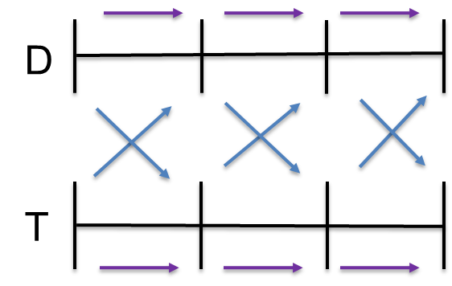

# T & D co-simulation with PSS/E and OpenDSS
This section provides a brief overview of T & D co-simulation with PSSE and OpenDSS as implemented in TDcoSim. Further details and theory can be found in [A combined transmission and distribution system co-simulation framework for assessing the impact of Volt/VAR control on transmission system](https://ieeexplore.ieee.org/document/8274633) and [Load Model Parameter Estimation by Transmission-Distribution Co-Simulation.](https://ieeexplore.ieee.org/document/8442939)

## Advantages
It offers two major advantages over doing separate simulations for the transmission and distribution system models.
   1. Higher degree of fidelity since there will not be aggregation of loads at the distribution system or generation sources at the transmission system.
   2. Running  a single co-simulation provides time savings over running separate  simulations for each system and manually combining the results.

## Assumptions in current software version

1. It is assumed that all the distribution feeders connected to the transmission system load bus have the same characteristics. Hence only one distribution feeder is simulated in an OpenDSS instance. The power output from the single feeder is then multiplied with a scaling factor (calculated automatically by TDcoSim) so that we can match the rated load at the transmission bus with the total load from all the feeders connected to the bus.
2. No Sub-station is not explicity added to the distribution network model by TDcoSim to interface the T bus with the distribution feeder. However if the user provided distribution network model comes with a sub-station, then it is used.

## T&D interface
The transmission system simulator (TSS) and distribution system simulator (DSS) are separate programs with their own solution methods. TDcoSim is responsible for exchanging data and synchronizing their runs.

### Data exchange
The TSS, PSSE uses positive sequence quantities while the DSS, OpenDSS uses phasor quantities. Hence it is necessary to convert one positive sequence to equivalent phasor quantity and vice-versa. After PSSE completes a solution, it outputs the sequence voltages at the T&D interface. Then (1) is applied to convert the sequence voltages at the boundary bus to phase voltages. Using the phase voltages at the boundary bus, the DSS completes a solution and outputs the phase current injection at the boundary bus, which are expressed in (2).

The phase current injection at the boundary bus is converted to sequence quantities using (3). The current injection at the boundary bus is then used to obtain complex power injection at the boundary bus using (4).

The obtained value of S_TS,+ is used as the total power requirement for the said load bus at the transmission system. It is worth mentioning that the equivalence load that is replaced with the distribution system simulator is modeled as a constant power load with respect to the transmission system simulator . The data exchange across the T&D interface is illustrated in Fig. 1.

  <strong>Fig. 1. </strong>Data exchange across T+D interface.

### Synchronization

Both static and dynamic co-simulation starts with an initialization for both PSSE and OpenDSS software. The T&D interface contains sockets that enable simulators to communicate and exchange data. Specifically, the TSS and the DSS are synchronized through two protocols, namely, loosely coupled and tightly coupled protocols. The loosely coupled protocol is illustrated in Fig. 2.

  <strong>Fig. 2. </strong>Loosely couple protocol.

## Steady-state T&D Co-simulation Process
The data exchange protocol for steady-state co-simulation is loosely coupled. The initialization steps are:

1. Input case files (both PSSE and OpenDSS).
2. Run power flow in PSSE.
3. Get voltage (p.u.) at load bus from PSSE.
4. Set OpenDSS VSource voltage to be equal to the voltage from load bus.
5. Run power flow in OpenDSS, get P and Q requirement for DNetworks.
6. Scale P & Q using scaling factor and set as input to T bus.

The scaling factor (see [assumptions](#assumptions)) is calculated by dividing the total load at a transmission system load bus and the load of one distribution feeder.

## Dynamic T&D Co-simulation Process
The data exchange protocol for steady-state co-simulation is loosely coupled. The initialization steps are:

1. Input case files (both PSSE and OpenDSS).
2. Run power flow in PSSE.
3. Get voltage (p.u.) at load bus from PSSE.
4. Set OpenDSS VSource voltage to be equal to the voltage from load bus.
5. Run power flow in OpenDSS, get P and Q requirement for DNetworks.
6. Compute difference of P & Q between TNetworkBus and DNetwork.
7. Calculate compensating shunt value using .
8. Add  and  as fixed compensating shunt in PSSE.
9. Repeat steps 2 to 8 until the user specified simulation end time is reached.

A time step of half a cycle is utilized in the dynamic co-simulation process.
