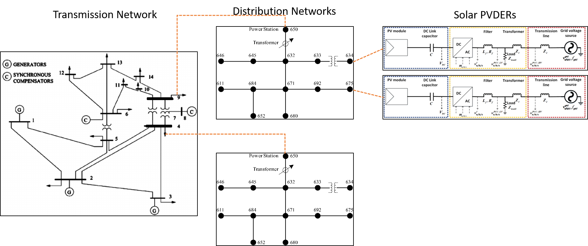

# Introduction

T&D co-simulation performed with detailed transmission and distribution system models is a powerful tool to conduct studies that capture short and long term interactions between these two systems. It offers two major advantages over independent modelling of the transmission and distribution systems.

1. Higher degree of fidelity since there will not be aggregation of loads at the distribution system or generation sources at the transmission system.
2. Convenience of running a single simulation as opposed separate simulations for each system and manually combining the results.

This guide introduces users to Argonne's T & D co-simulation tool (**TDcoSim**). Multiple examples that illustrate the capabilities of the tool are also included.

***
***To Do:*** Should we add **NERC brochure** as an appendix?

***

## What is it?

**TDcoSim** is a software tool that  can be used to perform static and dynamic co-simulation of transmission and distribution networks with photovoltaic systems as distributed energy resources (PV-DER's). The following figure illustrates the various components that can be simulated using **TDcoSim**. 

  <strong>Fig. 1. </strong>Components that can be simulated using TDcoSim.

## How can I use it?
**TDcoSim** is available as an open source Python package and can be installed for free from it's GitHub repository. Additionally, the user needs to separately install [PSS®E](https://new.siemens.com/global/en/products/energy/services/transmission-distribution-smart-grid/consulting-and-planning/pss-software/pss-e.html) for simulating the transmission network, [OpenDSS](https://sourceforge.net/projects/electricdss/) for simulating the distribution network, and [Solar PV-DER simulation-utility.](https://github.com/sibyjackgrove/SolarPV-DER-simulation-utility) for simulating PV-DER's. Detailed installation instructions and links can be found [**here**](user_guide_installation.md).

## What are the inputs?

In order to run a co-simulation using **TDcoSim**, the user needs to provide the following inputs:

* Transmission system model in a format compatible with PSS/E (required)
* Distribution system model in a format compatible with OpenDSS (required)
* DER penetration level and ratings (optional).
* Fault events (optional).

## What are the outputs?

**TDcoSim** provides following outputs from each component of the T&D co-simulation:

* Transmission bus: voltage, frequency, active and reactive load, generator active and reactive power output
* Distribution feeder node: voltage, active and reactive load, DER active and reactive power output

## Types of studies

**TDcoSim** is intended to be used as a tool for studying static and dynamic impacts of distributed energy resources on the transmission system.
### Capabilities of current release
The studies that can be conducted with the current version of the software are listed below:

* Static studies
  1. Analyze generator dispatch with DER over 24 hours.
  2. Analyze voltage profile of both T-system and D-system with DER.

* Dynamic studies
  1. Impact of DER's tripping during transmission system faults.
  2. Impact of DER's riding through during transmission system faults.

***
***Note:*** Examples of dynamic studies performed with TDcoSim are included in appendix.

***

### Capabilities planned in next release
The studies that can be conducted in the next version of the software are listed below:

* Dynamic studies
  1. Impact of cloud cover event on conventional generators.
  2. Impact of unbalanced faults on DER tripping and ride through.
  3. Impact of line outages. 
  4. Impact of generator and load outages on system frequency under high DER penetration.
  
## Scalability and Solution time

The scale of the T & D system (including DER) to be co-simulated is limited only by the available memory (RAM) in the workstation where TDcoSim is installed. The solution time for the dynamic co-simulation depends on the number of distribution feeder instances and DER instances as well as on the number of logical cores available in the workstation. Solution times for a couple of dynamic co-simulation case studies that were obtained on a workstation with recommended system requirements can be found [here](user_guide_solution_times.md).

[Continue to Installation](user_guide_installation.md) 
